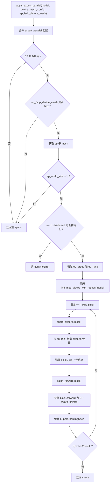
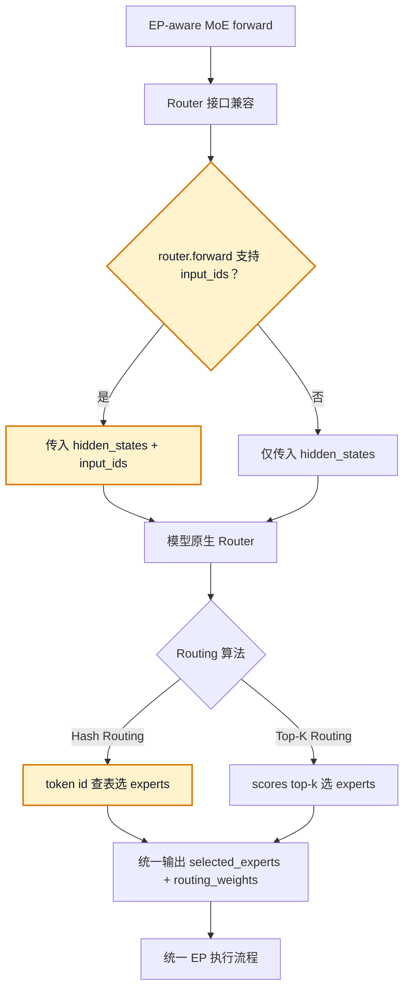
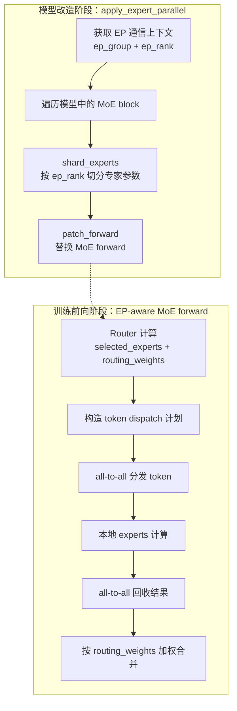

可以，按实现时序梳理的话，`memory_efficient_init` 的逻辑就是一条很明确的链路：

**1. 目标**

它要解决的问题是：

- 多卡/FSDP 训练时，如果每个 rank 都 `from_pretrained()`，CPU 内存会被放大成 `N` 份
- 所以改成：
  - `rank0` 真正加载完整 pretrained 权重
  - 其他 rank 只构造空模型
  - 后面再由 FSDP 路径把权重分发到各 rank

对应入口在 [transformers.py](/Users/linjiajia/project/twinkle/src/twinkle/model/transformers/transformers.py:164) 的 `memory_efficient_init` 参数。

**2. 初始化阶段的分支**

`TransformersModel.__init__()` 的核心分支在 [transformers.py](/Users/linjiajia/project/twinkle/src/twinkle/model/transformers/transformers.py:190)：

1. `model_id is None`  
   直接 `from_config(...)`，和 `memory_efficient_init` 无关。

2. `self._should_init_empty_pretrained_model_on_this_rank()` 为真  
   走 `_init_empty_model_from_config(...)`

3. 否则  
   走正常 `from_pretrained(...)`

这里真正决定“哪些 rank 构造空模型”的是 [transformers.py](/Users/linjiajia/project/twinkle/src/twinkle/model/transformers/transformers.py:210)：

```python
use_rank0_broadcast() and dist.is_initialized() and dist.get_rank() != 0
```

也就是：

- strategy 支持 rank0 broadcast
- 当前是分布式
- 当前 rank 不是 0

才会走空模型初始化。

**3. 空模型是怎么构造的**

在 [transformers.py](/Users/linjiajia/project/twinkle/src/twinkle/model/transformers/transformers.py:214)：

```python
with init_empty_weights(include_buffers=False):
    model = model_cls.from_config(...)
```

这意味着：

- 非 rank0 不加载真实参数
- 参数放在 meta device 上
- 几乎不占实际权重内存

然后如果模型有 `tie_weights()`，会补一次 tie。

**4. 为什么要看 strategy**

`memory_efficient_init` 本身不会单独生效，它依赖 strategy 的实现。

Native FSDP 这边在 [native_fsdp.py](/Users/linjiajia/project/twinkle/src/twinkle/model/transformers/strategy/native_fsdp.py:44)：

```python
def use_rank0_pretrained_broadcast(self) -> bool:
    return self._memory_efficient_init and self.device_mesh is not None
```

所以只有：
- `memory_efficient_init=True`
- 并且是分布式/FSDP 场景

才启用这套逻辑。

**5. rank0 和非 rank0 在 wrap 前各自状态**

到了 `NativeFSDPStrategy.wrap_model()`，如果 `use_meta=True`，会走这段 [native_fsdp.py](/Users/linjiajia/project/twinkle/src/twinkle/model/transformers/strategy/native_fsdp.py:76)：

- `rank0`：
  - `original_sd = model.state_dict()`
  - `saved_buffers = _get_non_persistent_buffers(model)`
- 非 `rank0`：
  - `original_sd = {}`
  - `saved_buffers = {}`

然后统一：

```python
model = model.to(torch.device('meta'))
```

也就是连 rank0 在 wrap 前也把模型重新挪到 meta，上面保存下来的 `original_sd` 才是后续恢复数据的来源。

**6. 真正的权重恢复发生在 fully_shard 之后**

这一步是关键。

流程在 [native_fsdp.py](/Users/linjiajia/project/twinkle/src/twinkle/model/transformers/strategy/native_fsdp.py:134)：

1. 先对 layer 和 root model 做 `fully_shard(...)`
2. 再调用：

```python
_load_rank0_full_state_dict(model, original_sd or {})
```

这个函数在 [native_fsdp.py](/Users/linjiajia/project/twinkle/src/twinkle/model/transformers/strategy/native_fsdp.py:518)，内部现在用的是：

```python
set_model_state_dict(
    model=model,
    model_state_dict=full_sd,
    options=StateDictOptions(
        full_state_dict=True,
        broadcast_from_rank0=True,
    ),
)
```

语义就是：

- rank0 持有完整 `full_sd`
- 其他 rank 传空 dict
- PyTorch 按当前 FSDP2 shard 布局，把 rank0 的 full weights 分发到各 rank

**7. non-persistent buffer 单独处理**

标准 `state_dict()` 不包含 `persistent=False` 的 buffer，所以 `memory_efficient_init` 还要补一段：

```python
_broadcast_non_persistent_buffers(model, saved_buffers or {}, ...)
```

调用点在 [native_fsdp.py](/Users/linjiajia/project/twinkle/src/twinkle/model/transformers/strategy/native_fsdp.py:138)。

所以恢复分两部分：

- 参数 + persistent buffers：`set_model_state_dict`
- non-persistent buffers：`_broadcast_non_persistent_buffers`

**8. 整体时序**

把它压成一条线就是：

1. `rank0` 正常 `from_pretrained`
2. 非 `rank0` 用 `init_empty_weights + from_config` 构造空模型
3. 第一次 forward 前 `_lazy_wrap_model()`
4. `fully_shard(model)`
5. rank0 保存过的 full state dict 通过 `set_model_state_dict(... broadcast_from_rank0=True)` 分发
6. 补 non-persistent buffers
7. 开始正常训练

**9. 好处**

- 避免每个 rank 都独立加载 HF 权重
- 多卡启动时 CPU 内存占用显著下降
- 和 FSDP2 的 shard 布局对齐

**10. 当前风险点**

这套实现当前最脆弱的地方也很明确：

- 它依赖 `broadcast_from_rank0=True`
- 如果底层 collective/HCCL object/tensor broadcast 有问题，就会卡在 `_load_rank0_full_state_dict()`
- 所以它解决的是“多 rank 重复加载”问题，不解决“分发链路本身不通”问题

一句话总结：

**`memory_efficient_init` 的本质不是“更省显存加载模型”，而是“只让 rank0 加载完整 pretrained 权重，其他 rank 构造 meta 空模型，再在 FSDP wrap 后统一分发恢复”。**

如果你要，我下一步可以把这条链路再画成一个“rank0 / non-rank0 对照表”。
按 `rank0 / non-rank0` 对照表看，会更清楚。

| 阶段 | rank0 | non-rank0 |
|---|---|---|
| `TransformersModel.__init__()` | `from_pretrained(...)` 加载完整权重 | `_init_empty_model_from_config(...)`，meta 空模型 |
| 进入 `wrap_model()` 前 | 手里有真实参数 | 只有模型结构，没有真实参数 |
| `use_meta` 分支开始 | `original_sd = model.state_dict()`，保存 full state dict | `original_sd = {}` |
| 转 meta | `model.to('meta')` | `model.to('meta')` |
| `fully_shard(...)` | 建立 FSDP2 shard 结构 | 建立 FSDP2 shard 结构 |
| `_load_rank0_full_state_dict(...)` | 把 `original_sd` 作为 full state 输入 | 传空 dict，等 rank0 广播 |
| `set_model_state_dict(... broadcast_from_rank0=True)` 后 | 本地拿到自己 shard | 本地拿到自己 shard |
| `_broadcast_non_persistent_buffers(...)` | 广播 non-persistent buffers | 接收并重建 non-persistent buffers |
| 训练开始 | shard model | shard model |

再压成一句话：

- `rank0` 负责“先加载、再提供 full state”
- `non-rank0` 负责“只建空壳、等 FSDP2 分发”

这也是为什么当前卡点如果出现在：

```python
_load_rank0_full_state_dict(...)
```

本质上卡的是“rank0 -> 其他 rank 的分发阶段”，不是前面的 `from_pretrained()`。

如果你愿意，我可以下一步把这个表直接整理成注释放到 `native_fsdp.py` 相关函数上方。


专家并行（Expert Parallel, EP）的核心思路是：**不让每张卡都持有全部专家，而是把专家参数按 EP rank 切分；前向时 router 仍然为每个 token 选择全局 expert id，然后通过 all-to-all 把 token 分发到对应专家所在 rank，本地专家计算完成后再 all-to-all 回收并按 routing weight 合并结果。**


在 DeepSeek V4 中，MoE router 有两种形式：普通 `TopKRouter` 和 `HashRouter`。当前 EP 适配没有为两者写两套 dispatch 逻辑，而是在 router 接入层做兼容：

- 对 `TopKRouter`：router 根据 hidden states 计算 logits，再选择 top-k experts，返回 `router_logits / routing_weights / selected_experts`。
- 对 `HashRouter`：expert 选择不是动态 top-k，而是通过 `tid2eid[input_ids]` 查表得到固定 expert id；同时仍然用 gate logits 计算这些专家的 routing weights。

Twinkle 的 EP patch 会保留 DeepSeek V4 原生 router 的输出。如果 router 的 `forward` 支持 `input_ids`，就把上层传入的 `input_ids` 透传给 router，因此 `HashRouter` 可以正常执行 `tid2eid[input_ids]`。随后，无论 selected experts 来自普通 top-k 还是 hash table，都会被当作**全局 expert id** 构造 `expert_mask`，进入统一的 token dispatch 流程：


这套适配的关键点是：**router 阶段尊重 DeepSeek V4 原生语义，dispatch 阶段统一使用全局 expert id。** 因此 TopKRouter 和 HashRouter 都可以复用同一套 EP 通信与专家计算框架。








